<div align="center">



</div>

<br>

## `> whoami`

```text
nombre   : Usuario444
rol      : estudiante
enfoque  : redes · infraestructura · seguridad
modo     : perfil bajo (si me ves por aquí, algo funcionó)
estado   : configurando routers virtuales, rompiéndolos y volviéndolos a configurar
```

<br>

## `> ls ~/stack`

**Lenguaje y datos**


**Sistema y herramientas**


**Laboratorio de redes**


**Apuntes**


**Lo básico en web**


<br>

## `> cat currently_learning.txt`

```text
ccna/
├── ITN   [ok]        Introduction to Networks
├── SRWE  [en curso]  Switching, Routing and Wireless Essentials
└── ENSA  [pendiente] Enterprise Networking, Security and Automation
```

Mi foco ahora mismo: terminar el path de **CCNA** y entender de verdad por qué un paquete llega (o no) a su destino.

<br>

## `> ls ~/proyectos`

```text
total 0
```

El directorio está vacío, pero no por mucho tiempo.

| Proyecto | Estado |
| :-- | :-- |
| Repositorio de Java | próximamente |
| Laboratorios de redes (Cisco) | próximamente |

<!--
Cuando tengas repos, lo más cómodo es fijarlos desde tu perfil:
"Customize your pins" y elige hasta 6. Luego puedes reemplazar la tabla
de arriba por una lista con enlaces y una línea de descripción por proyecto.
-->

<br>

<!--
## `> contacto`
Cuando quieras activarlo, quita las marcas de comentario y añade tus enlaces:

[LinkedIn](https://linkedin.com/in/TU_USUARIO) · [Correo](mailto:TU_CORREO)
-->

<div align="center">

<sub>Si llegaste hasta aquí, tu ping a mi perfil fue exitoso.</sub>


</div>
