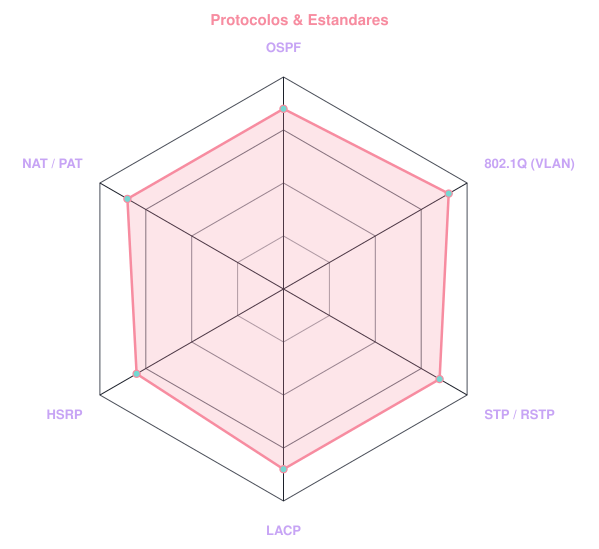

<div align="center">

<!-- LOCAL CITY-POP VIM TERMINAL BANNER (ANIMADO) -->
<a href="https://github.com/Usuario444">
  <picture>
    <source media="(prefers-color-scheme: dark)" srcset="assets/banner-dark.v9.svg">
    <source media="(prefers-color-scheme: light)" srcset="assets/banner-light.v9.svg">
    
  </picture>
</a>

<br><br>

<!-- ANIMATED TYPING HEADER (CITY-POP PALETTE) -->
<a href="https://github.com/Usuario444">
  
</a>

<br>


</div>

---

## `$ whoami`

<p align="center">
  
</p>

<br>

## `$ ls ~/stack`

**Lenguaje & Base de Datos**


<br>

**Sistemas & Herramientas de Desarrollo**


<br>

**Laboratorio de Redes & Análisis de Tráfico**


<br>

**Protocolos & Estándares**

> `802.1Q` · `LACP` · `STP / RSTP` · `OSPF` · `HSRP` · `NAT / PAT` · `ARP` · `DHCP` · `DNS` · `SSH`

<br>

**Apuntes & Productividad**


---

## `$ cat currently_learning.txt`

```text
ccna/
├── ITN   [ok]        Introduction to Networks
├── SRWE  [ok]        Switching, Routing and Wireless Essentials
└── ENSA  [pendiente] Enterprise Networking, Security and Automation
```

---

## `$ ip route show radar`

<p align="center">
  <picture>
    <source media="(prefers-color-scheme: dark)" srcset="assets/radar-dark.svg">
    <source media="(prefers-color-scheme: light)" srcset="assets/radar-light.svg">
    
  </picture>&nbsp;&nbsp;&nbsp;&nbsp;
  <picture>
    <source media="(prefers-color-scheme: dark)" srcset="assets/radar-langs-dark.svg">
    <source media="(prefers-color-scheme: light)" srcset="assets/radar-langs-light.svg">
    
  </picture>
</p>

<p align="center"><sub><code>telemetry: network_skills_radar · protocols_radar · status: converged</code></sub></p>

---

## `$ ls ~/proyectos`

```text
total 0
```

El directorio está vacío, pero no por mucho tiempo.

| Proyecto | Estado |
| :-- | :-- |
| Repositorio de Java | próximamente |
| Laboratorios de redes (Cisco) | próximamente |

<br>

---

<div align="center">

<sub>Si llegaste hasta aquí, tu ping a mi perfil fue exitoso.</sub>

<br><br>


</div>
